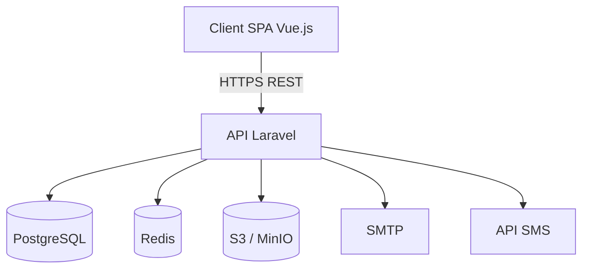

# Révision complète du CDC MALUNGA

## Objectif

Faire passer le `CDC_MALUNGA.md` de la version **1.1** à la version **2.0** : un document complet, cohérent, modernisé visuellement (diagrammes Mermaid) et prêt à servir de référence contractuelle.

Le seul fichier modifié sera [CDC_MALUNGA.md](CDC_MALUNGA.md). Aucun code applicatif n'est créé à ce stade.

## Phase 1 — Corrections d'incohérences (rapide)

- **§Métadonnées** : passer la version à 2.0 et la date à la date courante
- **§6.1 Architecture** : retirer « Next.js » du diagramme (ne garder que Vue.js conformément à la recommandation §6.2)
- **§6.2 Comparatif** : aligner la ligne Laravel sur **PostgreSQL** (au lieu de MySQL) pour cohérence avec §6.1 et la recommandation
- **§3 Parties prenantes** + **§4.1 Rôles** : ajouter explicitement le rôle **Secrétariat** (cité en §4.5 et UC-03 mais absent de la liste officielle), avec ses permissions :
  - Justification d'absences
  - Saisie des dossiers élèves
  - Édition des coordonnées parents
- **§2.1 Périmètre** : confirmer l'inclusion de l'**emploi du temps** (déjà en §4.4 mais à expliciter dans le périmètre)

## Phase 2 — Enrichissement des sections existantes

### §5.1 Sécurité (ajouts ciblés)

- **Politique de mot de passe** : 12 caractères minimum, mélange majuscule/minuscule/chiffre/spécial, rotation 90 jours pour admins, historique des 5 derniers
- **Sessions JWT** : access token 15 min, refresh token 7 jours, révocation à la déconnexion
- **2FA optionnel** pour les rôles Administrateur et Secrétariat (TOTP type Google Authenticator)
- **Mention contexte international** : RGPD comme référence, adaptabilité aux cadres locaux (loi RDC sur la protection des données personnelles si applicable)

### §5.3 Ergonomie et accessibilité

- Ajout conformité **WCAG 2.1 niveau AA**
- Support clavier complet, contraste suffisant, lecteurs d'écran

### §7 Modèle de données

- Ajout des entités manquantes : `annees_scolaires`, `trimestres`, `emplois_du_temps` (créneaux), `justificatifs_absence`, `pieces_jointes`
- Clarification des cardinalités (un parent ↔ N élèves, un élève ↔ N parents éventuellement)
- Ajout des champs d'audit (`created_at`, `updated_at`, `created_by`)

## Phase 3 — Diagrammes Mermaid

Remplacer les schémas ASCII actuels par des diagrammes Mermaid rendus :

- **§6.1** : diagramme d'architecture (`flowchart`)
- **§7** : diagramme entité-relation (`erDiagram`) à la place du schéma ASCII actuel (`utilisateurs`, `eleves`, `enseignants`, etc.)
- **§8** : diagramme de cas d'usage global (acteurs ↔ UC)
- **§8 / UC-04** : diagramme de séquence pour la génération du bulletin

## Phase 4 — Nouveaux cas d'usage

Ajouter dans §8 :

- **UC-07 — Gestion de l'emploi du temps** (Administrateur) : création des créneaux, affectation enseignant/salle, détection de conflits
- **UC-08 — Messagerie interne** (tous rôles) : envoi/réception, notification non-lu, historique
- **UC-09 — Justification d'absence par le parent** (Parent / Secrétariat) : upload justificatif, validation, mise à jour statut
- **UC-10 — Configuration d'une année scolaire** (Administrateur) : création année, trimestres, archivage de l'année précédente

## Phase 5 — Sections nouvelles

Ajouter (avant le glossaire pour rester cohérent avec la table des matières existante) :

- **§Historique des versions** (placé en début de document, après le bloc de métadonnées) : tableau version / date / auteur / changements
- **§10 Planning prévisionnel** : phases (Cadrage → Conception → Dev → Recette → Déploiement → Garantie), jalons indicatifs, durée estimée par phase
- **§11 Critères de recette et tests d'acceptation** : par module (gestion élèves, notes, bulletins, absences, messagerie), avec format Given/When/Then
- **§12 Plan de migration des données existantes** : audit des sources (tableurs, papier), mapping cible, phases (extraction → nettoyage → import → validation), bascule
- **§13 Plan de formation des utilisateurs** : 4 parcours (Admin/Secrétariat/Enseignant/Parent), modalités (présentiel + e-learning), supports, durée
- **§14 Support post-livraison et SLA** : garantie 12 mois, niveaux de criticité (P1/P2/P3), temps de réponse cibles, modalités d'évolutivité
- **§Annexes** : A1 modèle d'import CSV élèves, A2 modèle d'import CSV enseignants, A3 maquettes UX (référence à fournir séparément)

Renuméroter les sections **Gestion des risques** (actuellement §9) et **Glossaire** (actuellement §10) en conséquence.

## Phase 6 — Cohérence finale

- Régénérer la **Table des matières** avec toutes les nouvelles sections
- Vérifier les ancres (liens internes)
- Mettre à jour le pied de page (« Version 2.0 · Avril 2026 »)
- Relecture finale de cohérence terminologique (Trimestre, RBAC, JWT, etc. — vérifier qu'ils sont bien dans le glossaire)

## Hors scope (pour cette révision)

- Aucun code applicatif (pas de scaffolding Laravel/Vue)
- Aucun fichier autre que `CDC_MALUNGA.md`
- Pas de génération réelle de maquettes Figma (juste référence en annexe)
